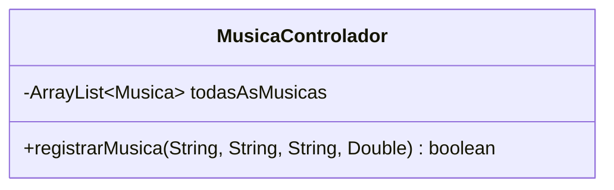
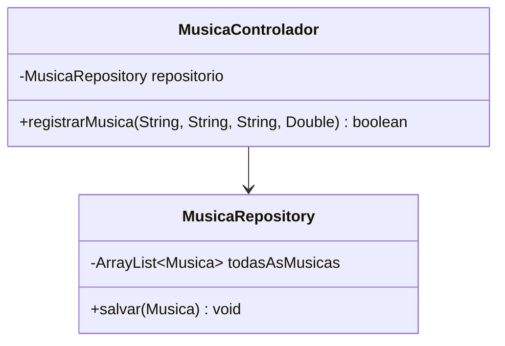
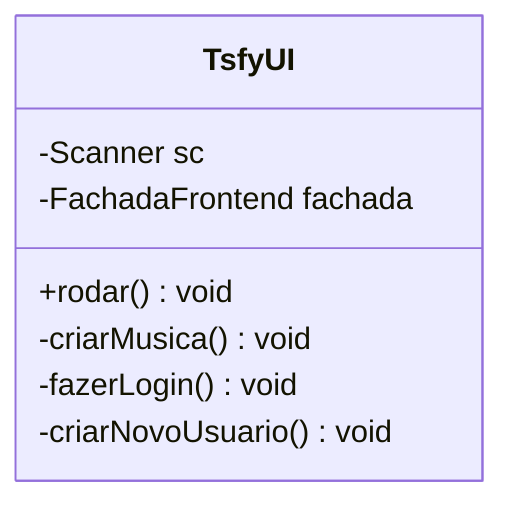
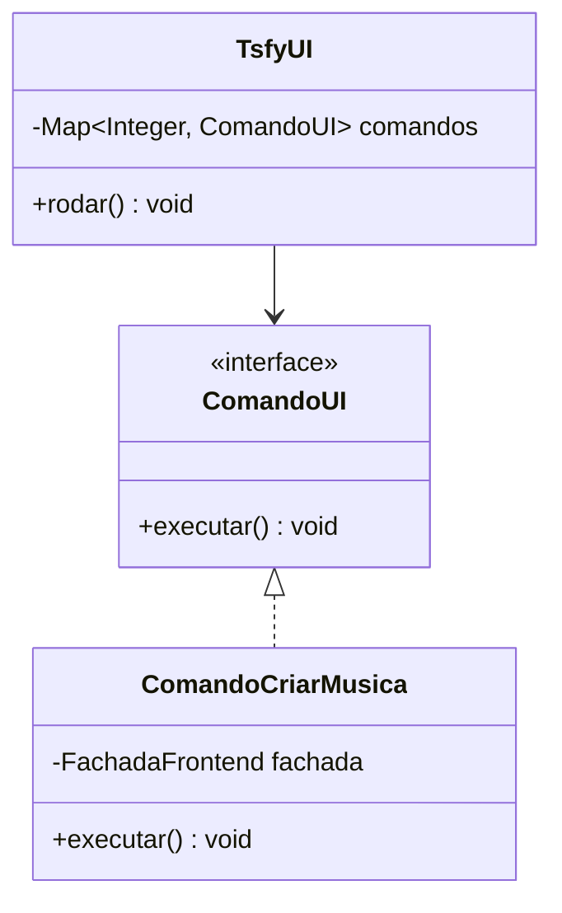
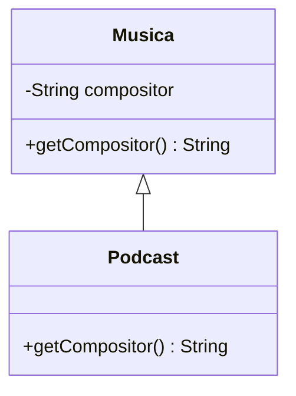
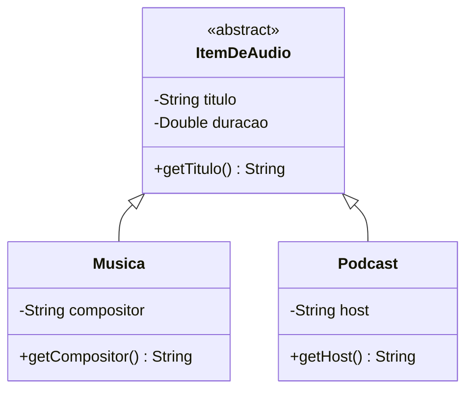
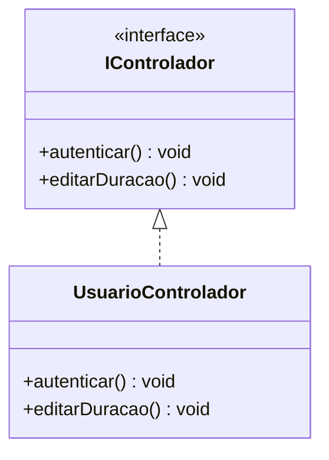
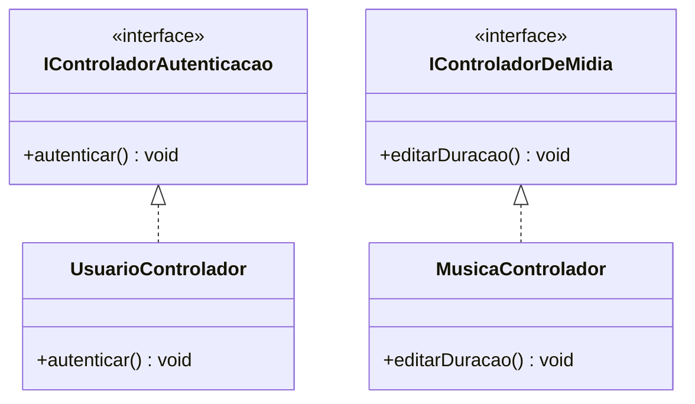
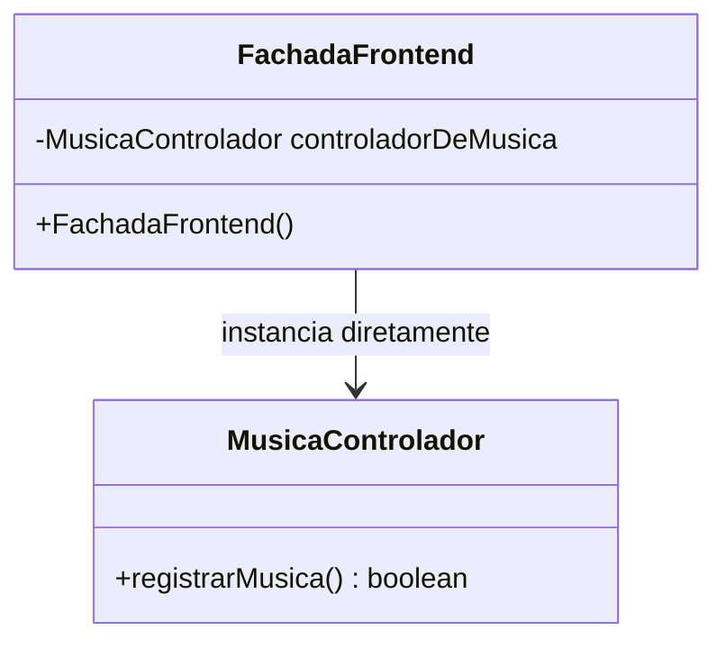
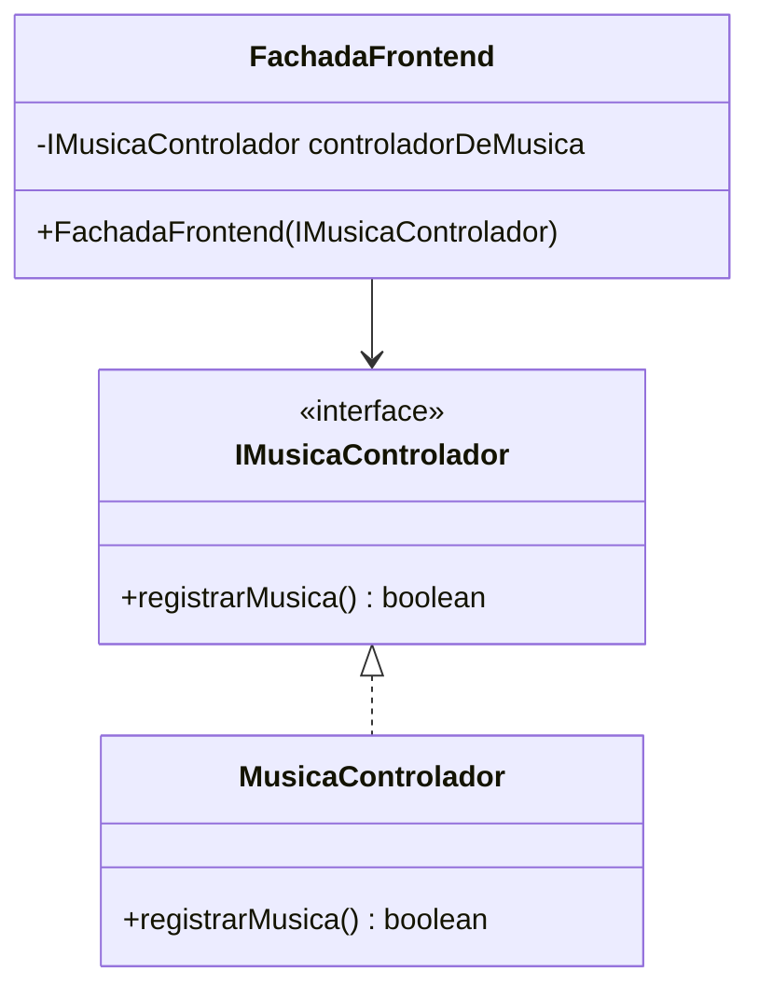

# Relatório de Correções de Design - Princípios SOLID

Este documento detalha as refatorações arquiteturais realizadas no backend do projeto. Para cada princípio SOLID violado na arquitetura inicial, são apresentados o problema, o código e diagrama violados, bem como a solução aplicada com o novo código e diagrama.

---

## 1. Violação do SRP (Single Responsibility Principle)
> *"Uma classe deve ter um, e apenas um, motivo para mudar."*

A classe `MusicaControlador` está violando o Princípio da Responsabilidade Única. Ela é responsável tanto pela lógica de negócios quanto por salvar os dados em um `ArrayList`. Se o armazenamento mudar para SQL, a classe precisará ser modificada.

### Código Violado
```java
public class MusicaControlador {
    private ArrayList<Musica> todasAsMusicas = new ArrayList<>();

    public boolean registrarMusica(String titulo, String compositor, String interprete, Double duracao) {
        Musica novaMusica = new Musica(titulo, compositor, interprete, duracao);
        this.todasAsMusicas.add(novaMusica); 
        return true;
    }
}
```

#### Diagrama de classes violado


### Código Corrigido
A responsabilidade de manipulação e armazenamento dos dados foi isolada em uma nova classe chamada `MusicaRepository`.

```java
public class MusicaRepository {
    private ArrayList<Musica> todasAsMusicas = new ArrayList<>();

    public void salvar(Musica musica) {
        this.todasAsMusicas.add(musica);
    }
}

public class MusicaControlador {
    private MusicaRepository repositorio;

    public MusicaControlador(MusicaRepository repositorio) {
        this.repositorio = repositorio;
    }

    public boolean registrarMusica(String titulo, String compositor, String interprete, Double duracao) {
        Musica nova = new Musica(titulo, compositor, interprete, duracao);
        this.repositorio.salvar(nova); 
        return true;
    }
}
```

#### Diagrama de Classes Corrigido


---

## 2. Violação do OCP (Open/Closed Principle)
>*"Entidades de software devem estar abertas para extensão, mas fechadas para modificação."*

O método `rodar()` da classe `TsfyUI` dependia de um switch/case para controlar o menu, exigindo alterações diretas no arquivo a cada nova opção inserida no sistema.

### Código Violado
```java
public class TsfyUI {
    public void rodar() {
        switch (op) {
            case 1: criarNovoUsuario(); break;
            case 2: fazerLogin(); break;
            case 3: criarMusica(); break;
        }
    }
}
```

#### Diagrama de classes violado


### Código Corrigido
Utilização do padrão de projeto **Command**. Cada opção do menu torna-se uma classe isolada que estende uma interface comum.

```java
public interface ComandoUI {
    void executar();
}

public class ComandoCriarMusica implements ComandoUI {
    private FachadaFrontend fachada;
    
    public ComandoCriarMusica(FachadaFrontend fachada) { 
        this.fachada = fachada; 
    }
    
    @Override
    public void executar() {
    }
}

public class TsfyUI {
    private Map<Integer, ComandoUI> comandos = new HashMap<>();

    public TsfyUI() {
        comandos.put(3, new ComandoCriarMusica(new FachadaFrontend()));
    }

    public void rodar() {
        ComandoUI comando = comandos.get(op);
        if (comando != null) {
            comando.executar();
        }
    }
}
```

#### Diagrama de Classes Corrigido


---

## 3. Violação do LSP (Liskov Substitution Principle) SIMULADO
>*"Classes derivadas devem poder ser substituídas por suas classes bases sem que o comportamento do programa seja corrompido."*

*(Nota: O projeto base não possui estruturas de herança. Este é um cenário simulado criado demonstrando como uma expansão incorreta violaria a regrade lsp).*

Ao adicionar suporte para `Podcast`, uma herança direta de `Musica` quebraria o comportamento esperado, pois podcasts não possuem compositores, forçando o lançamento de exceções em métodos herdados.

### Código Violado (Simulado)
```java
public class Musica {
    private String compositor;
    
    public String getCompositor() { 
        return compositor; 
    }
}

public class Podcast extends Musica {
    @Override
    public String getCompositor() {
        throw new UnsupportedOperationException("Podcasts não possuem compositores");
    }
}
```

#### Diagrama de classes violado


### Código Corrigido
Foi criada uma abstração mais genérica (`ItemDeAudio`). As classes `Musica` e `Podcast` agora herdam apenas os atributos e métodos que fazem sentido para ambas, mantendo a integridade do polimorfismo.

```java
public abstract class ItemDeAudio {
    private String titulo;
    private Double duracao;
    
    public String getTitulo() { return titulo; }
}

public class Musica extends ItemDeAudio {
    private String compositor;
    
    public String getCompositor() { return compositor; }
}

public class Podcast extends ItemDeAudio {
    private String host;
    
    public String getHost() { return host; }
}
```

#### Diagrama de Classes Corrigido


---

## 4. Violação do ISP (Interface Segregation Principle) SIMULADO
>*"Muitas interfaces específicas são melhores do que uma interface única e geral."*

*(Nota : O projeto não possui interface. Este é um cenário simulado demonstrando como a criação de um que no projeto violaria a regra).*

Uma interface genérica `IControlador` forçaria a classe `UsuarioControlador` a implementar o método `editarDuracao()`, que não faz sentido para o escopo de um usuário.

### Código Violado (Simulado)
```java
public interface IControlador {
    void autenticar();
    void editarDuracao();
}

public class UsuarioControlador implements IControlador {
    @Override
    public void autenticar() {
    }

    @Override
    public void editarDuracao() {
        throw new UnsupportedOperationException("Usuários não possuem duração");
    }
}
```

#### Diagrama de classes violado


### Código Corrigido
A interface inchada foi segregada em interfaces menores e coesas (`IControladorAutenticacao` e `IControladorDeMidia`). Agora, cada controlador assina apenas os contratos que realmente utiliza.

```java
public interface IControladorAutenticacao {
    void autenticar();
}

public interface IControladorDeMidia {
    void editarDuracao();
}

public class UsuarioControlador implements IControladorAutenticacao {
    @Override
    public void autenticar() {
    }
}

public class MusicaControlador implements IControladorDeMidia {
    @Override
    public void editarDuracao() {
    }
}
```

#### Diagrama de Classes Corrigido


---

## 5. Violação do DIP (Dependency Inversion Principle)
>*"Dependa de abstrações, não de implementações concretas."*

A classe `FachadaFrontend` dependia fortemente de implementações concretas porque criava os objetos diretamente usando a palavra-chave `new` em seu construtor, gerando forte acoplamento.

### Código Violado
```java
public class FachadaFrontend {
    private MusicaControlador controladorDeMusica;

    public FachadaFrontend(){
        this.controladorDeMusica = new MusicaControlador();
    }
}
```

#### Diagrama de classes violado


### Código Corrigido
A interface `IMusicaControlador` foi adicionada para atuar como uma abstração. Além disso, a fachada passou a adotar a Injeção de Dependência, recebendo a dependência instanciada via construtor.

```java
public interface IMusicaControlador {
    boolean registrarMusica(String titulo, String compositor, String interprete, Double duracao);
}

public class MusicaControlador implements IMusicaControlador {
    @Override
    public boolean registrarMusica(String titulo, String compositor, String interprete, Double duracao) {
        return true;
    }
}

public class FachadaFrontend {
    private IMusicaControlador controladorDeMusica;

    public FachadaFrontend(IMusicaControlador controladorDeMusica) {
        this.controladorDeMusica = controladorDeMusica;
    }
}
```

#### Diagrama de Classes Corrigido

