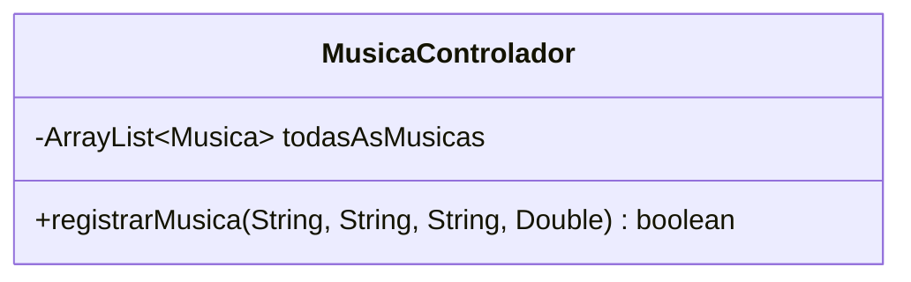
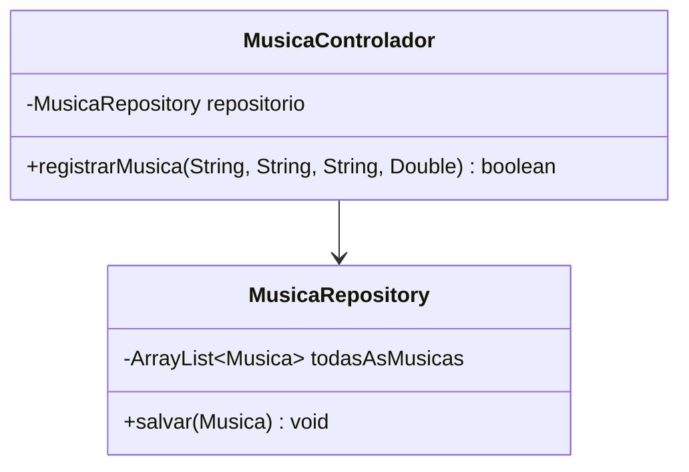
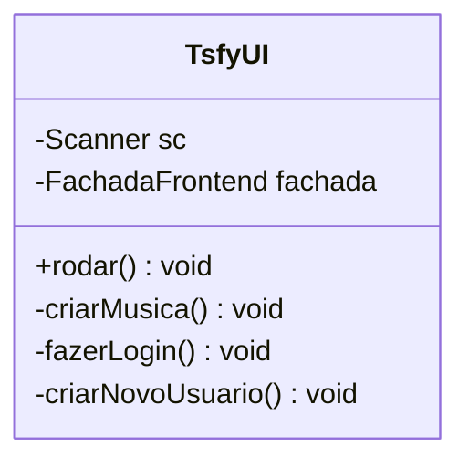
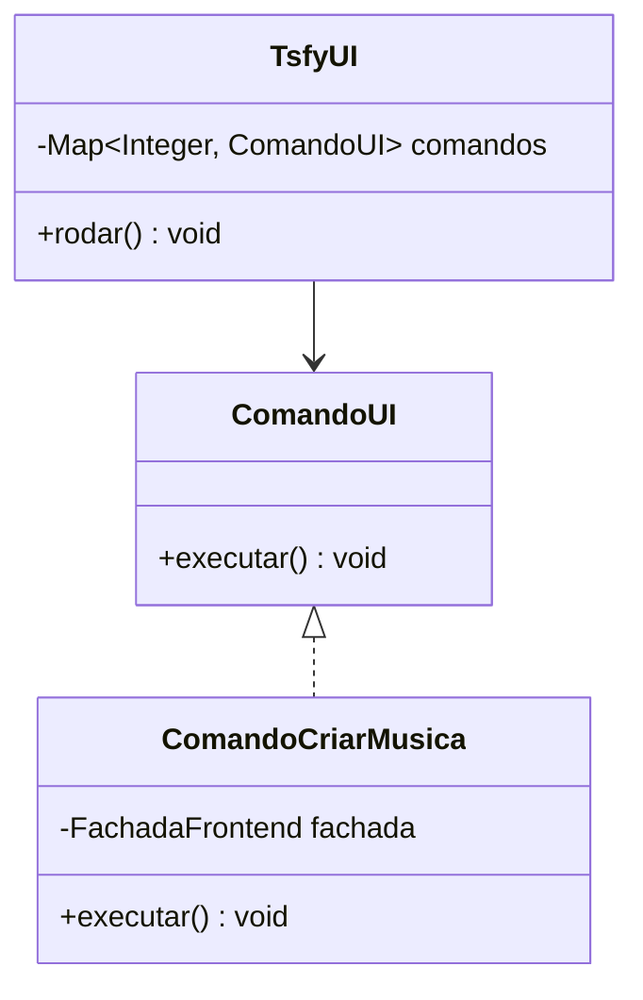
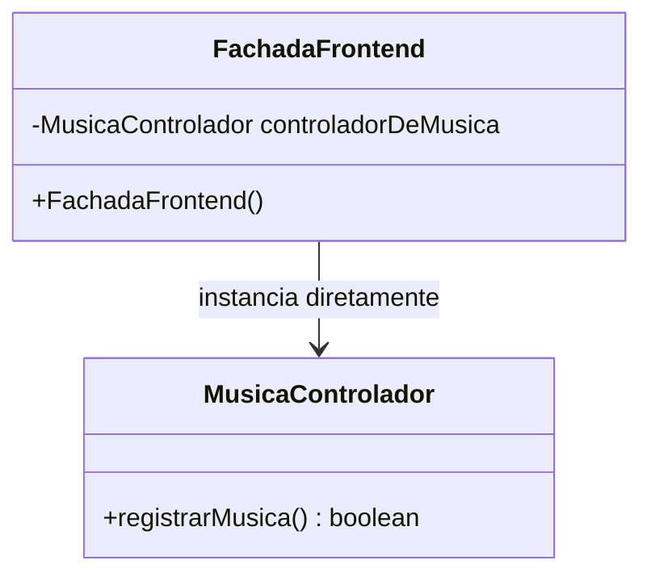
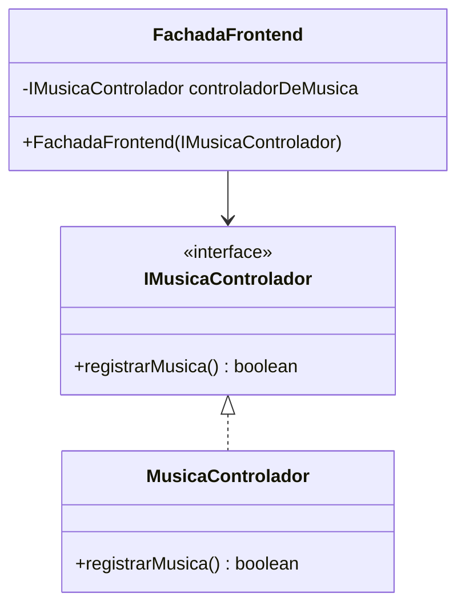

# Relatório de Correções de Design - Princípios SOLID

Este documento detalha as refatorações arquiteturais realizadas no backend do projeto. Para cada princípio SOLID violado na arquitetura inicial, são apresentados o problema, o código e diagrama violados, bem como a solução aplicada com o novo código e diagrama.

---

## 1. Violação do SRP (Single Responsibility Principle)
> *"Uma classe deve ter um, e apenas um, motivo para mudar."*

MusicaControlador está violando o Princípio da Responsabilidade Única. Ela é responsável tanto pela lógica de negócios quanto por salvar os dados em um ArrayList. Se o armazenamento mudar para SQL, a classe precisará ser modificada

### Código Violado
```java
public class MusicaControlador {
    private ArrayList<Musica> todasAsMusicas = new ArrayList<>(); //aqui

    public boolean registrarMusica(String titulo, String compositor, String interprete, Double duracao) {
        Musica novaMusica = new Musica(titulo, compositor, interprete, duracao);
        this.todasAsMusicas.add(novaMusica); 
        return true;
    }
}
```
#### Diagrama de classes violado


### Código Corrigido
A responsabilidade de manipulação e armazenamento dos dados foi isolada em uma nova classe chamada `MusicaRepository`.
```java
public class MusicaRepository {
    private ArrayList<Musica> todasAsMusicas = new ArrayList<>();

    public void salvar(Musica musica) {
        this.todasAsMusicas.add(musica);
    }
}

public class MusicaControlador {
    private MusicaRepository repositorio;

    public MusicaControlador(MusicaRepository repositorio) {
        this.repositorio = repositorio;
    }

    public boolean registrarMusica(String titulo, String compositor, String interprete, Double duracao) {
        Musica nova = new Musica(titulo, compositor, interprete, duracao);
        this.repositorio.salvar(nova); 
        return true;
    }
}
```

#### Diagrama de Classes Corrigido

---

## 2. Violação do OCP (Open/Closed Principle)
>*"Entidades de software devem estar abertas para extensão, mas fechadas para modificação."*

Como o método rodar() da classe TsfyUI dependia de um switch/case para controlar o menu, qualquer nova opção exigia alterar esse arquivo, violando o Princípio do SOLID.

### Código Violado
```java
public class TsfyUI {
    public void rodar() {
        switch (op) {
            case 1: criarNovoUsuario(); break;
            case 2: fazerLogin(); break;
            case 3: criarMusica(); break;
        }
    }
}
```

#### Diagrama de classes violado


### Código Corrigido
Utilização padrão de projeto **Command**. Cada opção do menu torna uma classe isolada que estende uma interface comum.
```java
public interface ComandoUI {
    void executar();
}

public class ComandoCriarMusica implements ComandoUI {
    private FachadaFrontend fachada;
    public ComandoCriarMusica(FachadaFrontend fachada) { this.fachada = fachada; }
    
    @Override
    public void executar() {
    }
}

public class TsfyUI {
    private Map<Integer, ComandoUI> comandos = new HashMap<>();

    public TsfyUI() {
        comandos.put(3, new ComandoCriarMusica(new FachadaFrontend()));
    }

    public void rodar() {
        ComandoUI comando = comandos.get(op);
        if (comando != null) {
            comando.executar();
        }
    }
}
```
#### Diagrama de Classes Corrigido

---

## 3. Violação do DIP (Dependency Inversion Principle)
>*"Dependa de abstrações, não de implementações concretas."*

Antes, a classe FachadaFrontend dependia muito de outras classes porque criava os objetos diretamente usando o 'new' no seu construtor.

### Código Violado
```java
public class FachadaFrontend {
    private MusicaControlador controladorDeMusica;

    public FachadaFrontend(){
        // VIOLAÇÃO: Alto nível instanciando componentes concretos de baixo nível
        this.controladorDeMusica = new MusicaControlador();
    }
}
```

#### Diagrama de classes violado


### Código Corrigido
A interface (IMusicaControlador) foi adicionada para isolar a complexidade. Além disso, a fachada passou a adotar a Injeção de Dependência, recebendo a dependência instanciada via construtor.

```java
public interface IMusicaControlador {
    boolean registrarMusica(String titulo, String compositor, String interprete, Double duracao);
}

public class MusicaControlador implements IMusicaControlador {
}

public class FachadaFrontend {
    private IMusicaControlador controladorDeMusica;

    public FachadaFrontend(IMusicaControlador controladorDeMusica) {
        this.controladorDeMusica = controladorDeMusica;
    }
}
```

#### Diagrama de Classes Corrigido

