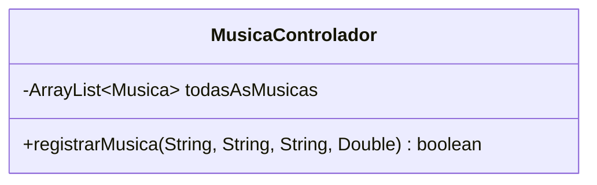
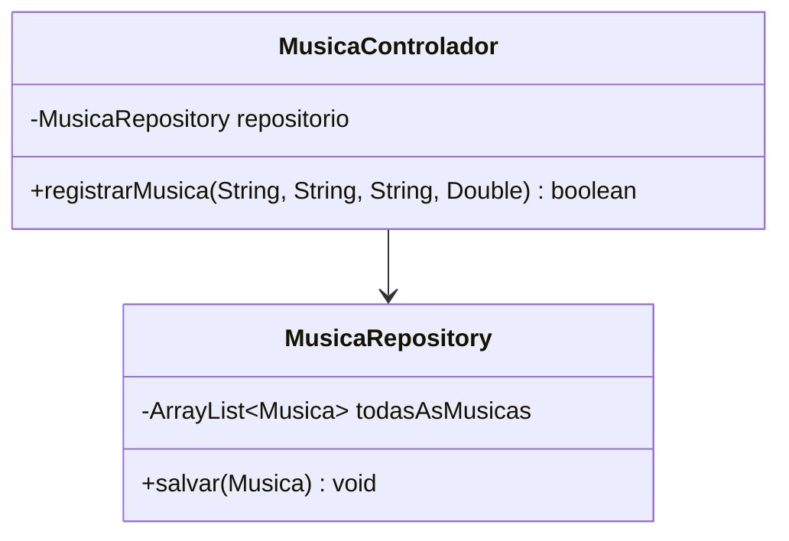

# Relatório de Correções de Design - Princípios SOLID

Este documento detalha as refatorações arquiteturais realizadas no backend do projeto. Para cada princípio SOLID violado na arquitetura inicial, são apresentados o problema, o código e diagrama violados, bem como a solução aplicada com o novo código e diagrama.

---

## 1. Violação do SRP (Single Responsibility Principle)
A classe MusicaControlador possui duas responsabilidades que são orquestrar as regras de negócio da música e atuar como um banco de dados em memória para armazenar os dados no ArrayList<Musica>. Qualquer mudança na forma de armazenamento, como por exemplo mudar para um banco de dados SQL, forçaria uma modificação na classe de controle.

### Código Violado
```java
public class MusicaControlador {
    private ArrayList<Musica> todasAsMusicas = new ArrayList<>(); //aqui

    public boolean registrarMusica(String titulo, String compositor, String interprete, Double duracao) {
        Musica novaMusica = new Musica(titulo, compositor, interprete, duracao);
        this.todasAsMusicas.add(novaMusica); 
        return true;
    }
}
```
#### Diagrama de classes violado


---
### Código Corrigido
A responsabilidade de manipulação e armazenamento dos dados foi isolada em uma nova classe chamada `MusicaRepository`.

```java
// Persistência
public class MusicaRepository {
    private ArrayList<Musica> todasAsMusicas = new ArrayList<>();

    public void salvar(Musica musica) {
        this.todasAsMusicas.add(musica);
    }
}

// Controlador
public class MusicaControlador {
    private MusicaRepository repositorio;

    public MusicaControlador(MusicaRepository repositorio) {
        this.repositorio = repositorio;
    }

    public boolean registrarMusica(String titulo, String compositor, String interprete, Double duracao) {
        Musica nova = new Musica(titulo, compositor, interprete, duracao);
        this.repositorio.salvar(nova); 
        return true;
    }
}
```

#### Diagrama de Classes Corrigido

